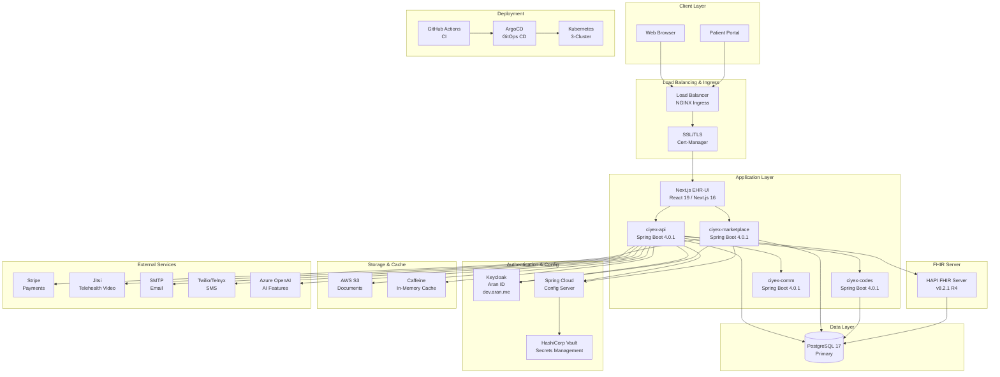
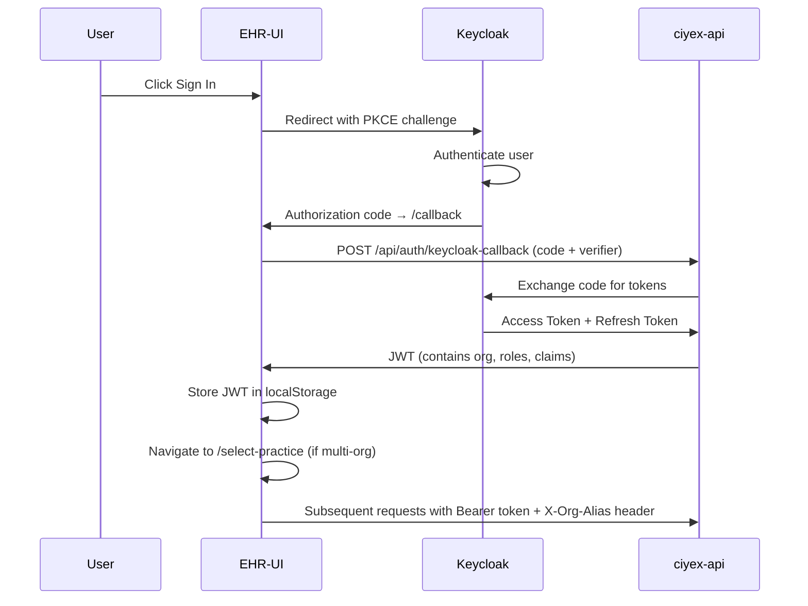
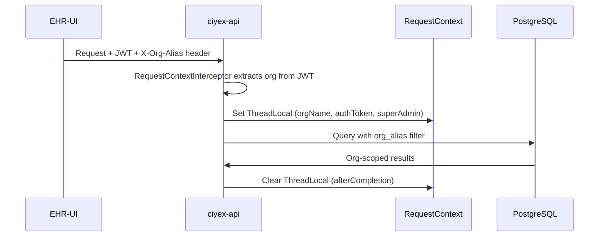
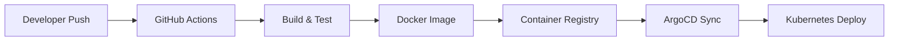

# System Architecture

This document provides a comprehensive overview of the Ciyex EHR system architecture, including all components, their interactions, and deployment patterns.

## High-Level Architecture



## Microservice Architecture

Ciyex EHR is composed of **5 backend services** that communicate via REST APIs:

| Service | Port | Purpose | Database |
|---------|------|---------|----------|
| **ciyex-api** | 8080 | Core EHR — patients, encounters, scheduling, billing, FHIR | `ask_ciya_dev` |
| **ciyex-marketplace** | 8081 | App marketplace — catalog, subscriptions, Stripe billing, vendor webhooks | `marketplace` |
| **ciyex-codes** | 8084 | Medical codes — ICD-10, CPT, HCPCS, CDT, SNOMED, LOINC, NDC | `ciyex_codes` |
| **ciyex-comm** | 8082 | Communications — email, SMS, fax, notifications | `ciyex_comm` |
| **HAPI FHIR** | 8090 | FHIR R4 server — clinical resource storage | `hapi_fhir` |

### ciyex-api (Core EHR)

The primary backend service with **67 REST controllers** covering:

- **Patient Management** — CRUD, demographics, search, medical history
- **Encounters** — Clinical documentation, SOAP notes, coding
- **Scheduling** — Provider availability, appointments, calendar
- **Billing** — Invoices, claims, payments, fee schedules
- **FHIR** — Generic FHIR resource controller (configuration-driven, no per-resource code)
- **Marketplace Integration** — App installations, SMART on FHIR, CDS Hooks
- **Patient Portal** — Self-registration, approvals, patient-facing APIs
- **Settings** — Tab/field configuration, menu customization, practice types
- **Eligibility** — Insurance eligibility verification (EDI)

### ciyex-marketplace (Hub)

The app marketplace service managing:

- **App Catalog** — 10+ apps with categories, pricing plans, media, reviews
- **Subscriptions** — Create, cancel, pause with Stripe billing
- **Vendor Webhooks** — HMAC-SHA256 signed event delivery
- **EHR Webhooks** — Subscription lifecycle sync to ciyex-api
- **Developer Portal** — Vendor registration, app submissions, API keys
- **Usage Metering** — Track per-org app usage for billing

### ciyex-codes (Medical Codes)

Reference code library:

- **ICD-10** — 98,000+ diagnosis codes
- **CPT** — AMA-licensed procedure codes (per-org toggle)
- **HCPCS** — 8,300+ codes
- **CDT** — 683 dental codes
- **SNOMED CT, LOINC, NDC** — Additional code systems
- **NCCI PTP Edits** — Claim validation rules
- **Fee Schedules** — Per-org + payer pricing

## Frontend Layer

### Next.js EHR-UI

- **Technology**: Next.js 16.1.6, React 19.2.4, TypeScript
- **Styling**: Tailwind CSS 4.1.18 with custom components
- **Icons**: Lucide React
- **Charts**: ApexCharts
- **Calendar**: FullCalendar 6.1.20
- **Video**: Jitsi Meet (@jitsi/react-sdk)
- **State**: React Context (SidebarContext, ThemeContext, MenuContext, PluginRegistryContext)

**Key Pages**:
- `/dashboard` — Consultation metrics, statistics, recent activity
- `/patients` — Patient list with search, CRUD
- `/patients/[id]` — Dynamic patient chart with FHIR tabs
- `/appointments` — FlowBoard appointment management
- `/all-encounters` — Encounter list with reports
- `/hub` — Ciyex Hub app marketplace browser
- `/hub/installed` — Installed apps management
- `/developer` — Developer portal with API keys, submissions, analytics
- `/settings` — Configuration-driven settings pages
- `/telehealth/[appointmentId]` — Jitsi video consultations
- `/messaging` — Secure provider-patient messaging
- `/patients/claim-management` — Claims dashboard
- `/patients/codes` — Medical code browser
- `/inventory-management` — Inventory, orders, suppliers

**Plugin Architecture**:
- Named slots for app UI extensions (`patient-chart:tab`, `patient-chart:banner-alert`, `encounter:toolbar`)
- `PluginRegistryContext` manages plugin contributions
- `NativePluginLoader` loads bundled plugins at startup

## Authentication & Authorization

### Keycloak (Aran ID)

- **Server**: `https://dev.aran.me` (dev), production via Vault
- **Realm**: `ciyex`
- **Protocol**: OAuth2 + OpenID Connect with PKCE
- **JWT Claims**: `organization` (org alias), `realm_access.roles`, `resource_access`
- **Roles**: `ADMIN`, `PROVIDER`, `PATIENT`

### Authentication Flow



### Authorization Rules (SecurityConfig)

```
Public (permitAll):
  /api/auth/**           Authentication endpoints
  /api/public/**         Public resources (SMART config, etc.)
  /api/portal/auth/**    Portal login
  /api/portal/approvals/** Patient approvals
  /api/internal/**       Service-to-service webhooks (HMAC verified)
  /actuator/**           Health checks

Role-Based:
  /api/admin/**          → ADMIN only
  /api/provider/**       → PROVIDER or ADMIN
  /api/portal/**         → PATIENT, PROVIDER, or ADMIN

Authenticated:
  /api/app-installations/** → Any authenticated user
  /api/smart-launch/**      → Any authenticated user
  /api/cds-hooks/**         → Any authenticated user
  Everything else           → Authenticated
```

## Multi-Tenancy

Ciyex uses **org_alias-based multi-tenancy** with a single shared database:



- **RequestContext**: ThreadLocal storing `orgName`, `authToken`, `superAdmin` per request
- **RequestContextInterceptor**: Extracts org from JWT `organization` claim
- **Super Admin**: Can override org via `X-Org-Alias` header (configured via `ciyex.super-admin.orgs`)
- **FHIR Partitioning**: `FhirTenantInterceptor` tags FHIR resources with tenant system

## Configuration Management

### Spring Cloud Config Server

All services fetch configuration from a centralized Config Server:

```
Config Server (https://config.apps-prod.us-east.in.hinisoft.com)
    └── Git Backend (github.com/qiaben/app-config.git)
        ├── ciyex/
        │   ├── application.yml         (common config)
        │   └── application-dev.yml     (dev overrides)
        ├── ciyex-marketplace/
        │   ├── application.yml
        │   └── application-dev.yml
        └── ciyex-codes/
            ├── application.yml
            └── application-dev.yml
```

### HashiCorp Vault

Secrets (database credentials, API keys) are stored in Vault:

- **Auth**: Kubernetes service account authentication
- **KV Engine**: `secret/ciyex`, `secret/ciyex-marketplace`
- **Dev Fallback**: K8s Secrets when Vault auth isn't configured

## Data Layer

### PostgreSQL 17

- **Architecture**: Single database per service, org_alias column for tenant isolation
- **Migrations**: Flyway versioned migrations (ciyex-api has 53 migrations)
- **JSONB**: Extensively used for flexible schemas (config, extension_points, field_config)
- **Caching**: Caffeine in-memory cache (not Redis) for code lookups and config

### Database Schema Highlights

**ciyex-api** key tables:
- `menu`, `menu_item`, `menu_org_override` — Dynamic sidebar navigation
- `tab_config`, `tab_field_config` — FHIR-mapped form configuration
- `custom_tab` — Org-specific patient chart tabs
- `practice_type`, `specialty` — Practice type definitions
- `app_installations` — Marketplace app tracking
- `app_usage_events`, `app_usage_daily` — App usage analytics
- `app_launch_logs` — HIPAA audit trail for app launches
- `eligibility_transactions` — Insurance eligibility records

**ciyex-marketplace** key tables:
- `apps`, `pricing_plans`, `app_media`, `app_certifications` — App catalog
- `vendors`, `vendor_api_keys` — Developer management
- `practices`, `subscriptions` — Org subscriptions
- `reviews`, `ratings` — App reviews
- `vendor_webhooks`, `webhook_delivery_logs` — Webhook management
- `metering_events` — Usage-based billing

## Deployment Architecture

### Kubernetes (3-Cluster)

| Cluster | Purpose | Services |
|---------|---------|----------|
| **kube-prod** | Production + ArgoCD + Vault | ArgoCD, Vault, Config Server |
| **kube-dev** | Development workloads | ciyex-api, marketplace, EHR-UI, PostgreSQL |
| **kube-stage** | Staging/QA | Pre-production testing |

### CI/CD Pipeline



- **CI**: GitHub Actions builds Docker images on push
- **CD**: ArgoCD watches `qiaben-kube-deployment` repo for manifest changes
- **GitOps**: All Kubernetes manifests stored in Git with Kustomize overlays

### Deployment Manifests

```
qiaben-kube-deployment/
├── apps/
│   ├── ciyex/                    # ciyex-api
│   │   ├── base/                 # Base K8s manifests
│   │   └── overlays/
│   │       ├── dev/              # Dev overrides (1 replica, dev secrets)
│   │       ├── staging/
│   │       └── prod/
│   ├── ciyex-marketplace/
│   ├── ciyex-ehr-ui/
│   ├── ciyex-codes/
│   └── ciyex-comm/
└── argocd/                       # ArgoCD Application manifests
```

## Security Architecture

### Defense Layers

1. **Network**: Kubernetes NetworkPolicies, NGINX Ingress
2. **TLS**: Cert-Manager auto-provisioned certificates
3. **Authentication**: Keycloak OAuth2 + JWT with PKCE
4. **Authorization**: Spring Security RBAC with role extraction from JWT
5. **Multi-Tenancy**: RequestContext + org_alias isolation
6. **FHIR**: Tenant-tagged resources with partition validation
7. **Webhooks**: HMAC-SHA256 signature verification
8. **Secrets**: HashiCorp Vault with Kubernetes auth

### HIPAA Compliance

- Audit logging for all data access and app launches
- Encryption in transit (TLS 1.3) and at rest (PostgreSQL)
- Role-based access control with principle of least privilege
- 6-year data retention for compliance

## Performance

### Caching Strategy

- **Caffeine** (in-memory) for frequently accessed data (code lookups, tab configs, menu data)
- **HTTP caching headers** for static assets (CDN)
- **FHIR client caching** per partition to avoid re-creating clients

### Database Optimization

- **HikariCP** connection pooling
- **Flyway** managed schema migrations
- **JSONB indexing** for config and metadata columns
- **Pagination** for all list endpoints

## Next Steps

- [Backend Architecture](architecture/backend-architecture.md) — Deep dive into Spring Boot patterns
- [Frontend Architecture](architecture/frontend-architecture.md) — Next.js and plugin system
- [FHIR Integration](architecture/fhir-integration.md) — Generic FHIR resource pattern
- [Deployment Models](architecture/deployment-models.md) — Compare deployment options
