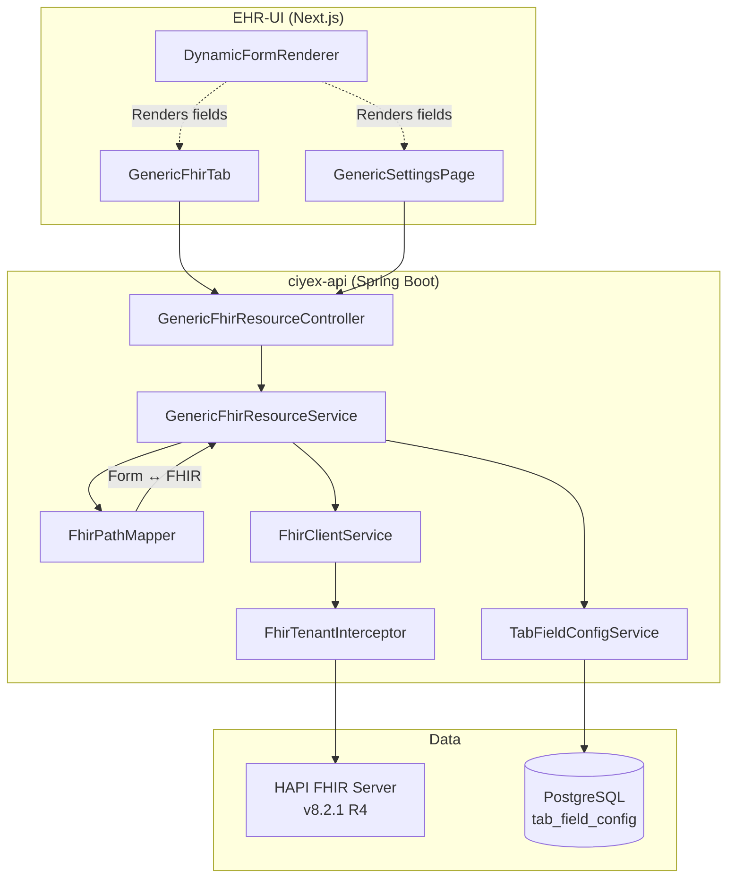

# FHIR Integration

Complete guide to HL7 FHIR R4 integration in Ciyex EHR — the configuration-driven architecture that powers patient charts, settings pages, and interoperability.

## Overview

Ciyex EHR uses a **generic, configuration-driven FHIR architecture** where a single controller handles ALL clinical and administrative resources. Instead of writing custom API endpoints per resource type, you configure a `tab_field_config` row with FHIR resource types and field mappings — the system handles the rest.

**Key principle**: Adding a new resource type = INSERT a database row. No Java code needed.

## Architecture



### Request Flow

```
1. UI Request
   GET /api/fhir-resource/demographics/patient/123

2. GenericFhirResourceController
   → Delegates to GenericFhirResourceService.list("demographics", 123)

3. GenericFhirResourceService
   → TabFieldConfigService.getConfig("demographics") → gets field mappings + FHIR resource types
   → Parses fhirResources: [{type:"Patient", patientSearchParam:"subject"}]
   → Parses fieldConfig sections → List<FieldMapping>

4. FhirClientService
   → Builds FHIR search: GET /{orgAlias}/Patient?subject=Patient/123
   → Client cached per org partition
   → FhirTenantInterceptor adds tenant meta tag on request

5. HAPI FHIR Server
   → Returns Bundle with matching resources

6. FhirTenantInterceptor
   → Verifies tenant tag on response resources

7. FhirPathMapper.fromFhirResource()
   → Converts FHIR Patient → flat form data: {firstName:"John", lastName:"Doe", ...}

8. Response
   → ApiResponse with paginated form data
```

## FHIR Server

- **Implementation**: HAPI FHIR Server v8.2.1
- **FHIR Version**: R4 (4.0.1)
- **Port**: 8090
- **Database**: `hapi_fhir` (PostgreSQL 17)
- **Partitioning**: URL path-based (`/{orgAlias}/{ResourceType}`)

## API Endpoints

### GenericFhirResourceController

All FHIR operations go through a single controller with two endpoint patterns:

#### Patient-Scoped (Chart Tabs)

Used for patient chart tabs — resources linked to a specific patient.

```http
# List resources for a patient (paginated)
GET /api/fhir-resource/{tabKey}/patient/{patientId}?page=0&size=20&encounterRef=

# Get single resource
GET /api/fhir-resource/{tabKey}/patient/{patientId}/{resourceId}

# Create resource
POST /api/fhir-resource/{tabKey}/patient/{patientId}
Content-Type: application/json
{ "fieldKey": "value", ... }

# Update resource
PUT /api/fhir-resource/{tabKey}/patient/{patientId}/{resourceId}
Content-Type: application/json
{ "fieldKey": "value", ... }

# Delete resource
DELETE /api/fhir-resource/{tabKey}/patient/{patientId}/{resourceId}
```

#### Non-Patient-Scoped (Settings Pages)

Used for settings pages — org-level resources not linked to a patient.

```http
# List all resources
GET /api/fhir-resource/{tabKey}?page=0&size=20

# Get single resource
GET /api/fhir-resource/{tabKey}/{resourceId}

# Create resource
POST /api/fhir-resource/{tabKey}
Content-Type: application/json
{ "fieldKey": "value", ... }

# Update resource
PUT /api/fhir-resource/{tabKey}/{resourceId}

# Delete resource
DELETE /api/fhir-resource/{tabKey}/{resourceId}
```

### Response Format

All responses use the standard `ApiResponse<T>` wrapper:

```json
{
  "status": "success",
  "message": "Resources retrieved",
  "data": {
    "content": [
      {
        "id": "Patient/abc-123",
        "fhirId": "abc-123",
        "firstName": "John",
        "lastName": "Doe",
        "gender": "male",
        "_resourceType": "Patient",
        "_lastUpdated": "2024-02-18T10:30:00Z"
      }
    ],
    "page": 0,
    "size": 20,
    "totalElements": 1,
    "totalPages": 1,
    "hasNext": false,
    "singleRecord": false
  }
}
```

## TabFieldConfig — The Configuration Engine

Every tab (patient chart or settings page) is defined by a row in the `tab_field_config` table. This is the core of the configuration-driven architecture.

### Schema

```sql
CREATE TABLE tab_field_config (
    id                  UUID PRIMARY KEY DEFAULT gen_random_uuid(),
    tab_key             VARCHAR(100) NOT NULL,
    practice_type_code  VARCHAR(100) NOT NULL DEFAULT '*',
    org_id              VARCHAR(100) NOT NULL DEFAULT '*',
    fhir_resources      JSONB NOT NULL DEFAULT '[]',
    field_config        JSONB NOT NULL,
    label               VARCHAR(255),
    icon                VARCHAR(100) DEFAULT 'FileText',
    category            VARCHAR(100) DEFAULT 'Other',
    category_position   INT DEFAULT 0,
    position            INT DEFAULT 0,
    visible             BOOLEAN DEFAULT true,
    api_base_path       VARCHAR(255),
    version             INT NOT NULL DEFAULT 1,
    created_at          TIMESTAMP NOT NULL DEFAULT now(),
    updated_at          TIMESTAMP NOT NULL DEFAULT now(),
    UNIQUE (tab_key, practice_type_code, org_id)
);
```

### 3-Level Fallback Resolution

Config is resolved with a priority fallback:

| Priority | Scope | Example |
|----------|-------|---------|
| 1 (highest) | Org-specific | `org_id = 'sunrise-clinic'` |
| 2 | Practice-type | `practice_type_code = 'dental'`, `org_id = '*'` |
| 3 (lowest) | Universal default | `practice_type_code = '*'`, `org_id = '*'` |

This means a dental practice sees dental-specific field layouts, but an individual org can further customize their own view — all without code changes.

### fhirResources Column

Defines which FHIR resource types this tab manages:

```json
[
  {
    "type": "Patient",
    "patientSearchParam": "subject",
    "searchParams": {}
  },
  {
    "type": "RelatedPerson",
    "patientSearchParam": "patient",
    "searchParams": {}
  }
]
```

| Field | Purpose |
|-------|---------|
| `type` | FHIR R4 resource type name (loaded via reflection) |
| `patientSearchParam` | Search parameter for patient reference. `null` = single-record mode (e.g., Patient resource itself) |
| `searchParams` | Additional filters applied at search/create time (e.g., `{"type":"ins"}` for insurance orgs) |

### fieldConfig Column

Defines the form layout with FHIR path mappings:

```json
{
  "sections": [
    {
      "key": "personal-info",
      "title": "Personal Information",
      "columns": 3,
      "collapsible": true,
      "fields": [
        {
          "key": "firstName",
          "label": "First Name",
          "type": "text",
          "required": true,
          "colSpan": 1,
          "fhirMapping": {
            "resource": "Patient",
            "path": "name[0].given[0]",
            "type": "string"
          }
        },
        {
          "key": "phone",
          "label": "Phone",
          "type": "phone",
          "fhirMapping": {
            "resource": "Patient",
            "path": "telecom.where(system='phone').value",
            "type": "string"
          }
        },
        {
          "key": "employerName",
          "label": "Employer",
          "type": "text",
          "fhirMapping": {
            "resource": "Patient",
            "path": "extension[url=http://ciyex.com/fhir/StructureDefinition/employer-name].valueString",
            "type": "string"
          }
        }
      ]
    }
  ]
}
```

#### Supported Field Types

| Type | Description | UI Component |
|------|-------------|--------------|
| `text` | Single-line text | Text input |
| `number` | Numeric value | Number input |
| `date` | Date picker | Date input |
| `datetime` | Date + time | DateTime input |
| `select` | Dropdown | Select with `options` array |
| `textarea` | Multi-line text | Textarea |
| `boolean` | Checkbox | Toggle |
| `email` | Email address | Email input |
| `phone` | Phone number | Phone input |
| `lookup` | API-backed autocomplete | Searchable dropdown with `lookupConfig` |
| `reference` | FHIR reference picker | Reference selector |
| `coded` | Medical code lookup | Code search (ICD-10, CPT, etc.) |
| `file` | File upload | File dropzone |
| `address` | Address block | Multi-field address |
| `computed` | Calculated value | Read-only (e.g., BMI from height/weight) |

## FhirPathMapper — Bidirectional Mapping

The `FhirPathMapper` converts between flat form data and HAPI FHIR R4 resources using path expressions. It uses Java reflection to dynamically load any FHIR R4 resource class.

### How It Works

```
Form Data (flat)                    FHIR Resource (nested)
─────────────────                   ──────────────────────
firstName: "John"        ←→         name[0].given[0]: "John"
lastName: "Doe"          ←→         name[0].family: "Doe"
phone: "555-1234"        ←→         telecom.where(system='phone').value: "555-1234"
employerName: "Acme"     ←→         extension[url=...employer-name].valueString: "Acme"
```

**`toFhirResource()`** — Form data → FHIR resource (for create/update)
**`fromFhirResource()`** — FHIR resource → form data (for read/display)

### Supported Path Patterns

| Pattern | Example | Description |
|---------|---------|-------------|
| Simple property | `status` | Direct field access |
| Nested access | `period.start` | Dot-separated navigation |
| Array index | `name[0].given[0]` | Access array element by index |
| Where filter | `telecom.where(system='phone').value` | Find array entry matching predicate |
| Nested filter | `component.where(code.coding.code='8480-6').valueQuantity.value` | Deep property filtering |
| Extension | `extension[url=http://...].valueString` | FHIR extension with URL |

#### Where-Filter Details

The where-filter pattern is critical for resources with repeating elements:

```
telecom.where(system='phone').value
│       │                     │
│       └─ Filter: find       └─ Target: return this property
│          telecom entry
│          where system='phone'
└─ Array property to search
```

- If no matching entry exists, one is **auto-created** with the filter property set
- Filter properties can be nested: `code.coding.code='8480-6'`
- Target properties can be nested: `valueQuantity.value`

#### Extension Pattern Details

```
extension[url=http://ciyex.com/fhir/StructureDefinition/employer-name].valueString
│         │                                                            │
│         └─ Extension URL identifier                                  └─ Value type
└─ Extension array
```

Supported extension value types: `valueString`, `valueCode`, `valueDateTime`, `valueDate`, `valueBoolean`, `valueInteger`, `valueDecimal`, `valueCoding`, `valueReference`

### Type Conversions

| Mapping Type | HAPI FHIR Class | Example Value |
|-------------|-----------------|---------------|
| `string` | StringType | `"John"` |
| `code` | CodeType | `"active"` |
| `date` | DateType | `"1985-06-15"` |
| `dateTime` | DateTimeType | `"2024-02-18T10:30:00Z"` |
| `boolean` | BooleanType | `true` |
| `decimal` | DecimalType | `99.99` |
| `integer` | IntegerType | `42` |
| `reference` | Reference | `"Patient/123"` |
| `quantity` | Quantity | `75` (with optional `unit`) |

## Multi-Tenant FHIR Partitioning

FHIR resources are isolated per organization using three layers:

### 1. URL Path Partitioning

Each org gets its own FHIR URL path:

```
https://fhir.example.com/{orgAlias}/Patient
https://fhir.example.com/sunrise-family-medicine/Patient
https://fhir.example.com/downtown-dental/Observation
```

`FhirClientService` maintains a per-org client cache:

```java
private final ConcurrentHashMap<String, IGenericClient> clientCache;
// One FHIR client per org, reused across requests
```

### 2. Tenant Meta Tag (FhirTenantInterceptor)

Every FHIR resource is tagged with the creating org's identifier:

```json
{
  "resourceType": "Patient",
  "meta": {
    "tag": [
      {
        "system": "http://ciyex.com/tenant",
        "code": "sunrise-family-medicine",
        "display": "Tenant ID"
      }
    ]
  }
}
```

- **On request**: Interceptor injects tenant tag into resource before sending to FHIR server
- **On response**: Interceptor verifies tenant tag matches current org; throws exception on mismatch

### 3. Database RLS (tab_field_config)

```sql
ALTER TABLE tab_field_config ENABLE ROW LEVEL SECURITY;
CREATE POLICY tfc_tenant_policy ON tab_field_config
    USING (org_id = '*' OR org_id = current_setting('app.current_org', true));
```

## Supported Resource Types

### Patient Chart Tabs

| Tab Key | FHIR Resources | Category |
|---------|---------------|----------|
| `demographics` | Patient, RelatedPerson | General |
| `vitals` | Observation | Clinical |
| `allergies` | AllergyIntolerance | Clinical |
| `medications` | MedicationRequest | Clinical |
| `immunizations` | Immunization | Clinical |
| `encounters` | Encounter | Clinical |
| `problem-list` | Condition | Clinical |
| `procedures` | Procedure | Clinical |
| `lab-results` | DiagnosticReport | Clinical |
| `insurance` | Coverage | General |
| `documents` | DocumentReference | General |
| `appointments` | Appointment | General |
| `referrals` | ServiceRequest | Clinical |
| `billing` | Claim, ClaimResponse, ExplanationOfBenefit, PaymentReconciliation, Invoice | Financial |
| `education` | Communication | Clinical |

### Settings Pages

| Tab Key | FHIR Resources | Purpose |
|---------|---------------|---------|
| `providers` | Practitioner | Practice providers |
| `referral-providers` | Practitioner | External referral providers |
| `referral-practices` | Organization | External practices |
| `insurance` | Organization (type=ins) | Insurance payers |
| `practice` | Organization (type=prov) | Practice information |
| `services` | HealthcareService | Services offered |
| `facilities` | Location | Physical locations |
| `template-documents` | DocumentReference | Document templates |
| `codes` | CodeSystem, ValueSet | Custom code sets |
| `integration` | Endpoint | Integration endpoints |
| `forms` | Questionnaire | Custom forms |

### Dynamic Resource Support

Any FHIR R4 resource type can be added — `FhirPathMapper` uses reflection:

```java
Class.forName("org.hl7.fhir.r4.model." + resourceType)
```

No hardcoded resource type list exists. If HAPI FHIR has a model class for it, it works.

## Adding a New Resource Type

To add a new FHIR-backed tab (e.g., "Care Plans"):

### Step 1: Insert tab_field_config

```sql
INSERT INTO tab_field_config (tab_key, fhir_resources, field_config, label, icon, category, position)
VALUES (
  'care-plans',
  '[{"type":"CarePlan","patientSearchParam":"subject","searchParams":{}}]',
  '{
    "sections": [{
      "key": "plan-info",
      "title": "Care Plan",
      "columns": 2,
      "fields": [
        {
          "key": "title",
          "label": "Plan Title",
          "type": "text",
          "required": true,
          "fhirMapping": {"resource":"CarePlan","path":"title","type":"string"}
        },
        {
          "key": "status",
          "label": "Status",
          "type": "select",
          "options": [
            {"value":"active","label":"Active"},
            {"value":"completed","label":"Completed"},
            {"value":"revoked","label":"Revoked"}
          ],
          "fhirMapping": {"resource":"CarePlan","path":"status","type":"code"}
        },
        {
          "key": "startDate",
          "label": "Start Date",
          "type": "date",
          "fhirMapping": {"resource":"CarePlan","path":"period.start","type":"date"}
        },
        {
          "key": "description",
          "label": "Description",
          "type": "textarea",
          "colSpan": 2,
          "fhirMapping": {"resource":"CarePlan","path":"description","type":"string"}
        }
      ]
    }]
  }',
  'Care Plans',
  'ClipboardList',
  'Clinical',
  15
);
```

### Step 2: Done

That's it. The UI automatically renders the new tab with:
- `GenericFhirTab` fetching from `/api/fhir-resource/care-plans/patient/{patientId}`
- `DynamicFormRenderer` building the form from `fieldConfig`
- `FhirPathMapper` converting form data ↔ FHIR CarePlan resources
- Full CRUD with pagination

No Java code. No React components. No API endpoints.

## Tab Configuration API

Manage tab configurations programmatically:

```http
# List all available tabs
GET /api/tab-field-config/tabs

# Get config for a specific tab
GET /api/tab-field-config/{tabKey}?practiceType=*

# Get tab layout grouped by category
GET /api/tab-field-config/layout

# Save org-specific field config override
PUT /api/tab-field-config/{tabKey}
Content-Type: application/json
{
  "practiceTypeCode": "*",
  "fhirResources": [...],
  "fieldConfig": {...},
  "category": "Clinical"
}

# Save org-specific tab layout (bulk)
PUT /api/tab-field-config/layout
Content-Type: application/json
{
  "tabConfig": [
    {
      "label": "Clinical",
      "position": 0,
      "tabs": [
        {"key":"encounters","label":"Encounters","icon":"Stethoscope","visible":true,"position":0},
        {"key":"vitals","label":"Vitals","icon":"Activity","visible":true,"position":1}
      ]
    }
  ]
}

# Reset org override (revert to defaults)
DELETE /api/tab-field-config/{tabKey}

# Reset org layout to defaults
DELETE /api/tab-field-config/layout
```

## Examples

### Vitals — Observation with LOINC Components

Creating a vitals record demonstrates where-filter mapping with LOINC codes:

**Request**:
```http
POST /api/fhir-resource/vitals/patient/123
Content-Type: application/json

{
  "weightKg": "75",
  "heightCm": "180",
  "bpSystolic": "120",
  "bpDiastolic": "80",
  "pulse": "72"
}
```

**Field Mappings**:
```json
{
  "key": "weightKg",
  "fhirMapping": {
    "resource": "Observation",
    "path": "component.where(code.coding.code='29463-7').valueQuantity.value",
    "type": "quantity",
    "loincCode": "29463-7",
    "unit": "kg"
  }
},
{
  "key": "bpSystolic",
  "fhirMapping": {
    "resource": "Observation",
    "path": "component.where(code.coding.code='8480-6').valueQuantity.value",
    "type": "quantity",
    "loincCode": "8480-6",
    "unit": "mmHg"
  }
}
```

**What happens**: FhirPathMapper finds (or creates) an Observation.component entry with the matching LOINC code, then sets `valueQuantity.value`.

### Demographics — Multi-Resource Tab

The demographics tab maps to two FHIR resources (Patient + RelatedPerson):

**fhirResources**:
```json
[
  {"type": "Patient", "patientSearchParam": "subject"},
  {"type": "RelatedPerson", "patientSearchParam": "patient"}
]
```

**Field mappings span both resources**:
```json
{"key":"firstName", "fhirMapping":{"resource":"Patient","path":"name[0].given[0]","type":"string"}},
{"key":"lastName", "fhirMapping":{"resource":"Patient","path":"name[0].family","type":"string"}},
{"key":"phone", "fhirMapping":{"resource":"Patient","path":"telecom.where(system='phone').value","type":"string"}},
{"key":"email", "fhirMapping":{"resource":"Patient","path":"telecom.where(system='email').value","type":"string"}},
{"key":"emergencyContactName", "fhirMapping":{"resource":"RelatedPerson","path":"name[0].given[0]","type":"string"}},
{"key":"emergencyContactPhone", "fhirMapping":{"resource":"RelatedPerson","path":"telecom.where(system='phone').value","type":"string"}}
```

On create, the service creates a Patient AND a RelatedPerson, each with their mapped fields.

### Insurance Settings — Filtered Organization

Settings pages use `searchParams` to filter by type:

**fhirResources**:
```json
[{"type": "Organization", "patientSearchParam": null, "searchParams": {"type": "ins"}}]
```

- `patientSearchParam: null` means no patient scope (settings page)
- `searchParams: {"type": "ins"}` filters to insurance organizations only
- Creating a new entry auto-sets `Organization.type` to the `ins` CodeableConcept

## Caching

| Layer | Strategy | Purpose |
|-------|----------|---------|
| FHIR Client | `ConcurrentHashMap` per org | Avoid recreating `IGenericClient` |
| Search queries | `CacheControlDirective.setNoCache(true)` | Always fresh data (critical for EHR) |
| Tab configs | Caffeine cache in TabFieldConfigService | Avoid repeated DB lookups |
| Application | No `@Cacheable` on FHIR operations | Accuracy over performance for clinical data |

## External Interoperability

### Direct FHIR Access

External systems can access the HAPI FHIR server directly:

```http
GET https://fhir.example.com/fhir/Patient?name=Doe
Authorization: Bearer {token}
Accept: application/fhir+json
```

### SMART on FHIR

Third-party apps (installed from Ciyex Hub) can launch with patient context:

```http
# SMART configuration endpoint
GET /api/smart-launch/.well-known/smart-configuration

# EHR launch
GET /api/smart-launch/launch?app_id={appSlug}&patient={patientId}

# Standalone launch
GET /api/smart-launch/authorize?client_id={clientId}&scope=launch/patient
```

### CDS Hooks

Clinical Decision Support hooks fire during clinical workflows:

```http
# Discovery endpoint
GET /api/cds-hooks/cds-services

# Hook invocation (by ciyex-api to installed apps)
POST {app_hook_endpoint}
Content-Type: application/json
{
  "hook": "patient-view",
  "hookInstance": "uuid",
  "context": {
    "patientId": "123",
    "userId": "Practitioner/456"
  },
  "fhirServer": "https://fhir.example.com/fhir",
  "fhirAuthorization": {
    "access_token": "...",
    "token_type": "Bearer"
  }
}
```

### Bulk Data Export

```http
# System-level export
GET /fhir/$export
Prefer: respond-async

# Patient-level export
GET /fhir/Patient/$export
Prefer: respond-async

# Check export status
GET /fhir/$export-poll-status?_jobId=abc123
```

## Key Components

| Component | File | Responsibility |
|-----------|------|----------------|
| GenericFhirResourceController | `fhir/GenericFhirResourceController.java` | REST endpoints (CRUD) |
| GenericFhirResourceService | `fhir/GenericFhirResourceService.java` | Business logic, config parsing |
| FhirPathMapper | `fhir/FhirPathMapper.java` | Bidirectional form-to-FHIR mapping |
| FhirClientService | `fhir/FhirClientService.java` | FHIR client management, URL partitioning |
| FhirTenantInterceptor | `interceptor/FhirTenantInterceptor.java` | Tenant tag injection and verification |
| TabFieldConfig | `tabconfig/entity/TabFieldConfig.java` | Configuration entity |
| TabFieldConfigService | `tabconfig/service/TabFieldConfigService.java` | Config resolution with fallback |
| TabFieldConfigController | `tabconfig/controller/TabFieldConfigController.java` | Config management API |

## Next Steps

- [Backend Architecture](backend-architecture.md) — Spring Boot patterns and package structure
- [Frontend Architecture](frontend-architecture.md) — GenericFhirTab and DynamicFormRenderer
- [REST API Reference](/docs/api/rest-api) — Full endpoint listing
